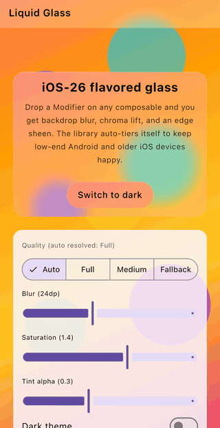

# LiquidGlass

**iOS 26-style frosted glass surfaces for Compose Multiplatform.** A `Modifier.liquidGlass()`
plus `GlassCard`, `GlassButton`, and `GlassNavBar` composables that produce backdrop blur,
chroma lift, and an edge sheen — with built-in quality tiers that degrade gracefully on
low-end Android and older iOS devices.

[](https://central.sonatype.com/artifact/io.github.nadeemiqbal/liquid-glass)
[](LICENSE)
[](https://github.com/NadeemIqbal/liquid-glass/actions/workflows/build.yml)
[](https://kotlinlang.org)


<p align="center">
  
</p>

## Why this library

Compose's `Modifier.blur` blurs a composable's **own** content, not the backdrop behind it.
Chris Banes's [`haze`](https://github.com/chrisbanes/haze) library solves the backdrop-blur
problem beautifully, but it doesn't auto-degrade for memory-constrained devices — and the
iOS 26 "liquid glass" effect is heavy enough that Apple disables it on older hardware.

`liquid-glass` is an opinionated, iOS-26-flavored take on glassmorphism with three explicit
quality tiers and platform auto-detection:

| Tier      | Blur radius | Saturation | Backdrop layer       | Auto-picked on                              |
|-----------|------------:|-----------:|----------------------|---------------------------------------------|
| Full      |       24.dp |       1.4× | Full-res             | Android 12+ (non-low-RAM), iOS 17+, Desktop, Web |
| Medium    |       16.dp |       1.2× | 0.5× downsampled     | iOS 15–16 (opt-in elsewhere)                |
| Fallback  |        0.dp |       1.0× | **None — zero alloc**| Android < 12 or `isLowRamDevice`, iOS < 15  |

`Fallback` allocates **zero offscreen buffers** and skips the blur entirely — so the same
code runs without OOMing on a 2 GB Android 11 device and still looks reasonable.

## Platform support

| Platform | Supported | Auto-tier                                                |
|----------|:---------:|----------------------------------------------------------|
| Android  |     ✅     | Full on API 31+ (non low-RAM), Fallback otherwise         |
| iOS      |     ✅     | Full on iOS 17+, Medium on iOS 15–16, Fallback on < 15    |
| Desktop  |     ✅     | Full                                                     |
| Web      |     ✅     | Full                                                     |

## Installation

`gradle/libs.versions.toml`:

```toml
[libraries]
liquid-glass = { module = "io.github.nadeemiqbal:liquid-glass", version = "0.1.0" }
```

`commonMain` dependencies:

```kotlin
kotlin {
    sourceSets {
        commonMain.dependencies {
            implementation(libs.liquid.glass)
        }
    }
}
```

## Quick start

```kotlin
@Composable
fun Screen() {
    val state = rememberLiquidGlassState()    // auto-picks the tier for the device

    Box(Modifier.fillMaxSize()) {
        // 1) Anything inside this box becomes the backdrop that the glass samples from.
        Image(
            painter = painterResource(R.drawable.scenery),
            contentDescription = null,
            contentScale = ContentScale.Crop,
            modifier = Modifier.fillMaxSize().liquidGlassSource(state),
        )

        // 2) A floating glass card on top, sampling the backdrop above.
        GlassCard(
            state = state,
            modifier = Modifier.align(Alignment.Center).padding(24.dp),
        ) {
            Text("Frosted, light-refracting surface — drop-in")
        }
    }
}
```

That's it. Same code on Android, iOS, Desktop, and Web — and the same code on a low-RAM
Android 11 device will quietly fall back to a flat tint + edge sheen with **no GraphicsLayer
allocation**.

## Customization

Override individual parameters at the call site; the per-tier values from
`LiquidGlassDefaults.forQuality` are the sensible defaults:

```kotlin
GlassCard(
    state = state,
    shape = RoundedCornerShape(28.dp),
    blurRadius = 30.dp,
    saturation = 1.6f,
    tint = Color.White.copy(alpha = 0.35f),
    borderHighlight = Brush.verticalGradient(
        0f to Color.White.copy(alpha = 0.6f),
        1f to Color.Transparent,
    ),
) { /* … */ }
```

Force a specific tier (e.g. for a brand-mandated "Full everywhere" experience):

```kotlin
val state = rememberLiquidGlassState(LiquidGlassQuality.Full)
```

…or downgrade for low-end shells without waiting for auto-detection:

```kotlin
val state = rememberLiquidGlassState(LiquidGlassQuality.Fallback)
```

## API at a glance

| Symbol                          | Purpose                                                          |
|---------------------------------|------------------------------------------------------------------|
| `LiquidGlassQuality`            | `Full` / `Medium` / `Fallback`                                    |
| `rememberPlatformLiquidGlassQuality()` | Platform-detected tier (`@Composable expect`)              |
| `rememberLiquidGlassState(quality)` | Holds the shared backdrop `GraphicsLayer` (or `null` for Fallback) |
| `Modifier.liquidGlassSource(state)` | Marks the backdrop composable                                |
| `Modifier.liquidGlass(state, …)`    | Marks the glass surface                                      |
| `GlassCard(state, …, content)`  | `Modifier.liquidGlass` wrapped around a padded `Box`             |
| `GlassButton(state, onClick, …)`| Pill-shaped clickable glass surface                              |
| `GlassNavBar(state, …, content)`| `Modifier.liquidGlass` over a status-bar-padded top bar          |
| `LiquidGlassDefaults`           | Per-tier `blurRadius`, `saturation`, `downsampleFactor`, tints   |

## Comparison

| Library                                                       | Backdrop blur | Per-device tiers | Zero-alloc fallback | API style                |
|---------------------------------------------------------------|:-------------:|:----------------:|:-------------------:|--------------------------|
| `Modifier.blur`                                               |       ❌       |        ❌         |          —          | Blurs own content only   |
| Material 3 `Surface` with `tonalElevation`                    |       ❌       |        ❌         |          —          | Flat tint, no blur       |
| [haze](https://github.com/chrisbanes/haze)                    |       ✅       |        ❌         |          ❌          | Generic, very flexible   |
| **liquid-glass**                                              |       ✅       |        ✅         |          ✅          | Opinionated iOS-26 look  |

## Roadmap

- [ ] `GlassDialog` and `GlassBottomSheet` Material 3 wrappers
- [ ] Dynamic-color edge sheen (sample from the captured backdrop)
- [ ] Android-only `RenderNode` direct path for fewer copies on API 31+
- [ ] Optional grain / noise overlay
- [ ] Refraction shader (Sk SL) on Skia-backed targets

## Contributing

See [CONTRIBUTING.md](CONTRIBUTING.md).

## License

[Apache 2.0](LICENSE).
